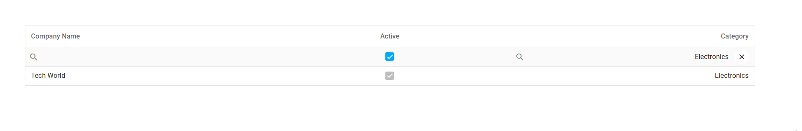

<!-- default badges list -->

[](https://supportcenter.devexpress.com/ticket/details/T1317695)
[](https://docs.devexpress.com/GeneralInformation/403183)
[](#does-this-example-address-your-development-requirementsobjectives)
<!-- default badges end -->
# DataGrid for DevExtreme - Customize Filter Row Editors

This example configures custom filter row editors within the DevExtreme [DataGrid](https://js.devexpress.com/Documentation/Guide/UI_Components/DataGrid/Overview/).



## Implementation Details

To customize DataGrid editors, implement an [onEditorPreparing](https://js.devexpress.com/Documentation/ApiReference/UI_Components/dxDataGrid/Configuration/#onEditorPreparing) handler. To apply changes only to the filter row, check that **EditorPreparingEvent**.**parentType** is *"filterRow"*.

You can customize DataGrid editors in two ways:

- Change the DevExtreme component used as the editor.
- Render custom markup in editor containers.

This example implements both approaches.

### Change the DevExtreme Component

Override **EditorPreparingEvent**.**editorName** to replace the default editor. Specify a DevExtreme component in the *"dxComponentName"* format (for instance, *"dxCheckBox"*).

```JavaScript
onEditorPreparing: (e) => {
    if (e.parentType === 'filterRow') {
        e.editorName = 'dxCheckBox';
        // ...
    }
}
```

This example implements this approach for the `IsActive` column.

### Render Custom Markup

To render custom markup in editor containers:

- Cancel the **EditorPreparingEvent** (set **EditorPreparingEvent**.**cancel** to `true`).
- Render your markup within **EditorPreparingEvent**.**editorElement** as follows:
    - **jQuery** and **ASP.NET Core**: Call the [append()](https://api.jquery.com/append/) method.
    - **React**, **Angular**, and **Vue**: Use the framework's DOM injection mechanisms.

```JavaScript
onEditorPreparing: (e) => {
    if (e.parentType === 'filterRow') {
        e.cancel = true;
	    // Render custom markup here
    }
}
```

This example implements this approach for the `CategoryID` column.

## Files to Review

- **jQuery**
    - [index.js](jQuery/src/index.js)
    - [data.js](jQuery/src/data.js)
- **Angular**
    - [app.component.html](Angular/src/app/app.component.html)
    - [app.component.ts](Angular/src/app/app.component.ts)
    - [app.service.ts](Angular/src/app/services/data.service.ts)
- **Vue**
    - [HomeContent.vue](Vue/src/components/HomeContent.vue)
    - [CustomEditor.vue](Vue/src/components/CustomEditor.vue)
    - [data.ts](Vue/src/data.ts)
- **React**
    - [App.tsx](React/src/App.tsx)
    - [CustomEditor.tsx](React/src/components/CustomEditor.tsx)
    - [data.ts](React/src/data.ts)
    - [types.ts](React/src/types/CustomEditor.types.ts)
- **ASP.NET Core**    
    - [Index.cshtml](<ASP.NET Core/Views/Home/Index.cshtml>)
    - [CategoriesController.cs](<ASP.NET Core/Controllers/CategoriesController.cs>)
    - [CustomersController.cs](<ASP.NET Core/Controllers/CustomersController.cs>)

## Documentation

- [Getting Started with DataGrid](https://js.devexpress.com/Documentation/Guide/UI_Components/DataGrid/Getting_Started_with_DataGrid/)
- [DataGrid API - onEditorPreparing](https://js.devexpress.com/Documentation/ApiReference/UI_Components/dxDataGrid/Configuration/#onEditorPreparing)

<!-- feedback -->
## Does This Example Address Your Development Requirements/Objectives?

[](https://www.devexpress.com/support/examples/survey.xml?utm_source=github&utm_campaign=devextreme-datagrid-custom-filter-row-editor&~~~was_helpful=yes) [](https://www.devexpress.com/support/examples/survey.xml?utm_source=github&utm_campaign=devextreme-datagrid-custom-filter-row-editor&~~~was_helpful=no)

(you will be redirected to DevExpress.com to submit your response)
<!-- feedback end -->
